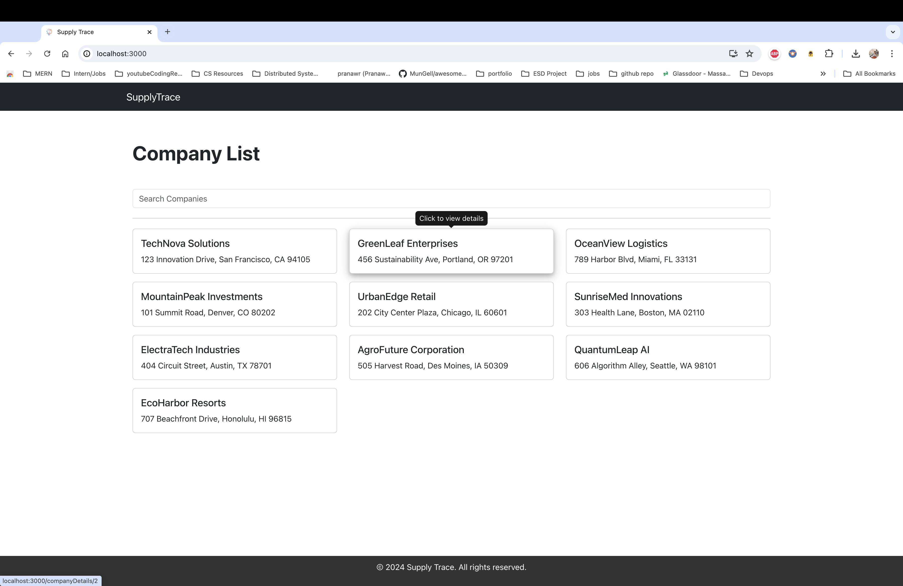

# TakeHome Assesment

- This project is a web application designed to display a list of companies and their details, including multiple possible locations. The application features a Python-based backend API and a React frontend with a two-page structure and map integration. The backend serves data from two CSV files, while the frontend offers an interactive and user-friendly interface for viewing and searching company information. The entire application is containerized using Docker and orchestrated with Docker Compose, ensuring a consistent and portable development and deployment environment. Application is also responsive for various screen sizes

## Table of Contents

- [Technologies Used](#technologies-used)
- [Prerequisites](#prerequisites)
- [Setup and Running](#setup-and-running)
  - [Clone the repository](#clone-the-repository)
  - [Backend (Django REST Framework)](#1-backend-django-rest-framework)
  - [Frontend (React App)](#2-frontend-react-app)
  - [Build and start with Docker](#3-build-and-start-with-docker)
- [How the applications looks](#how-the-applications-looks)

## Technologies Used

- **Backend**: Django REST Framework (Python)
- **Frontend**: React (JavaScript)
- **Containerization**: Docker, Docker Compose
- **Web Server**: Nginx (for serving React app)

## Prerequisites

Ensure you have the following installed on your system:

- python
- pip
- docker
- docker-compose
- nodejs
- npm

## Setup and Running

### Clone the repository

- `git clone https://github.com/akhilk2802/takehome-assesment.git`
- `cd assesment`

### 1. Backend (Django REST Framework)

- Navigate to the `backend` directory.
  `cd assesment_backend`
- Install dependencies by running `pip install -r requirements.txt`.
- Run migrations to set up the database by running `python manage.py migrate`. (since we are not using DB, you can skip this)
- Run the Django development server by running `python manage.py runserver`.
- The server will be available at `http://localhost:8000`.

### 2. Frontend (React App)

- Navigate to frontend directory.
  `cd assesment_frontend`
- Install dependencies by running `npm install`.
- Start the React development server by running `npm start`
- Open your web browser and navigate to `http://localhost:3000` to view the app

### 3. Build and start with Docker

- Navigate to the root directory.
  `cd assesment`
- Build with docker-compose
  `docker-compose build`
- Start with docker-compose
  `docker-compose up`
- The server will be available at `http://localhost:8000` and the frontend at `http://localhost`
- You can access the frontend by navigating to `http://localhost` in your web browser
- You can access the backend server by navigating to `http://localhost:8000` in postman or using curl

## How the applications looks

- Company List page
  

- Company Details page
  
